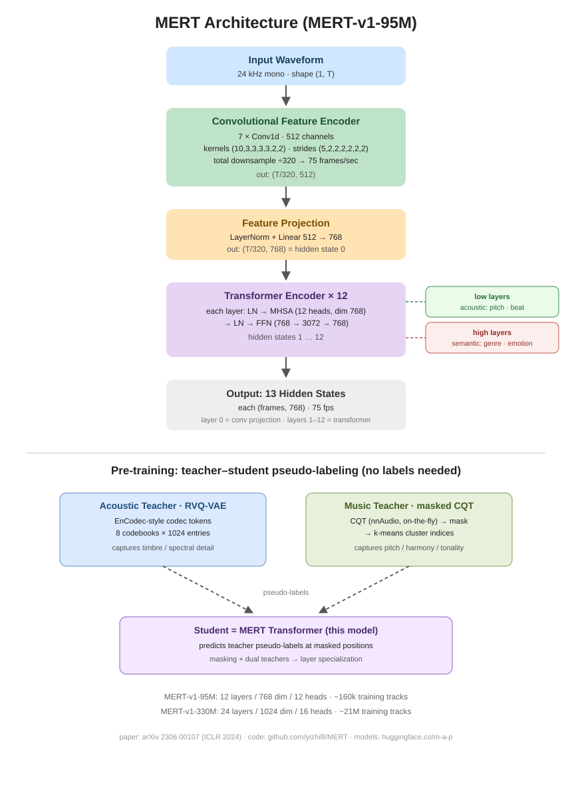

# MERT Colab Demo

A hands-on Google Colab notebook for **MERT** (*Acoustic Music undERstanding Model with Large-scale Self-supervised Training*, [ICLR 2024](https://arxiv.org/abs/2306.00107)) — a self-supervised pre-trained encoder for music audio, a.k.a. *HuBERT for music*.

## Architecture at a glance

**How to read the figure.** Audio (24 kHz mono) passes a 7-layer convolutional front-end (total downsample ÷320 → 75 frames/sec), a LayerNorm + Linear projection (512 → 768), and 12 Transformer layers, yielding **13 hidden states** of shape `(frames, 768)` — layer 0 is the projected conv output, layers 1–12 are the Transformer stages.

**Why the layers differ.** MERT was pre-trained with two complementary teachers — an **acoustic teacher** (RVQ-VAE codec tokens, capturing timbre and spectral detail) and a **music teacher** (masked CQT + k-means, capturing pitch, harmony and tonality). As a result, **low layers suit acoustic tasks** (pitch detection, beat tracking) while **high layers suit semantic tasks** (genre, emotion, tagging).

| | MERT-v1-95M | MERT-v1-330M |
|---|---|---|
| Transformer layers | 12 | 24 |
| Hidden size | 768 | 1024 |
| Attention heads | 12 | 16 |
| Parameters | ~95M | ~330M |
| Hidden states out | 13 | 25 |
| Pre-training data | ~160k tracks (~10k h) | ~21M tracks (~160k h) |

## What the notebook shows (text + figures)

1. **Layer-by-layer model anatomy** — every conv layer, the projection and the Transformer config, printed from the live model
2. **Architecture figure** — the pipeline drawn programmatically, right inside the notebook
3. **Shape trace** — tensor shapes at every stage in one forward pass
4. **Waveform & log-mel spectrogram figures** of the demo tracks, plus inline audio playback — always listen to your data
5. **Layer-wise cosine similarity** between two tracks (text bars + chart)
6. **Self-similarity heatmap** — 5-second-chunk structure analysis on layer 12
7. **Downstream pattern** — frozen MERT features + linear classifier skeleton
8. **Real-data experiment** — FMA-small genre classification with a **layer-by-layer linear probe** and an accuracy-vs-layer curve

## Quick start

1. Click the **Open in Colab** badge above
2. `Runtime → Change runtime type → T4 GPU` (CPU works too, just slower)
3. `Runtime → Run all`

> The §12 FMA experiment downloads ~7.2 GiB of audio (parallel download, typically 5–15 min on Colab, ~15 GiB free disk needed) and is self-contained — skip it if you only want the analysis sections.

## References

- Paper: [arXiv:2306.00107](https://arxiv.org/abs/2306.00107) (ICLR 2024)
- Code: <https://github.com/yizhilll/MERT>
- Models: [MERT-v1-95M](https://huggingface.co/m-a-p/MERT-v1-95M) · [MERT-v1-330M](https://huggingface.co/m-a-p/MERT-v1-330M)
- Data: [FMA dataset](https://github.com/mdeff/fma) (Defferrard et al., ISMIR 2017) — used in the §12 experiment
- Learn more: [KAIST GCT634 · Music Representation Learning](https://mac.kaist.ac.kr/~juhan/gct634/) (Juhan Nam) · [ISMIR tutorial: Self-Supervised Learning](https://music-classification.github.io/tutorial/part5_beyond/self-supervised-learning.html)
